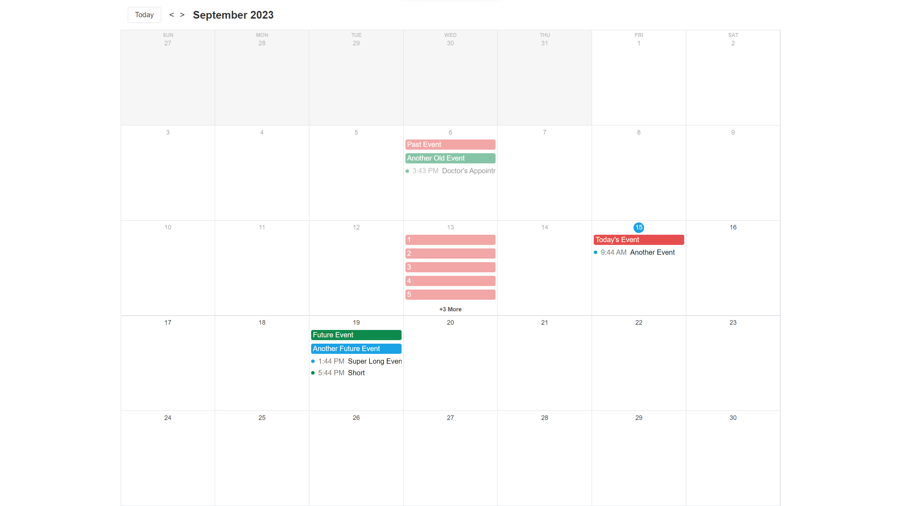
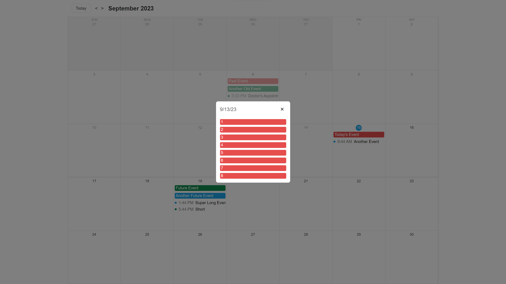

# Final Project

The final project of this course is a simplified Google Calendar clone. Even though this is a simplified clone it is still a quite complex project and is rather large so do not be surprised if this takes you a few days/weeks to complete. Some of the more complex parts of this project took me many hours to build.

This entire project should be built using TypeScript and React. The styling of the application can be completed using any method you choose (CSS, Tailwind, CSS-in-JS, etc.). Below are some mockups of what the final project should look like, CSS for the colors used, and detailed instructions on everything that should be included in the project. In order to get the full picture of what the project should look like make sure you reference the video explaining the final project as that video has a demonstration of the final project as well as a detailed explanation of what should be included.

## Colors

The colors you use do not need to be 100% perfect matches to the colors used in the mockups, but they should be close enough that there is no perceptible difference. The colors used in the mockups are listed below for your reference.

| Usage                            | Color              |
| -------------------------------- | ------------------ |
| Red Event                        | hsl(0, 75%, 60%)   |
| Blue Event                       | hsl(200, 80%, 50%) |
| Green Event                      | hsl(150, 80%, 30%) |
| Button Border                    | #dadce0            |
| Out Of Month Day Background      | #dadce0            |
| Default Text                     | #333               |
| Button Hover Background          | #f1f3f4            |
| Delete Button Border             | hsl(0, 75%, 60%)   |
| Delete Button Background         | hsl(0, 75%, 95%)   |
| Delete Button Text               | hsl(0, 75%, 10%)   |
| Delete Button Hover Background   | hsl(0, 75%, 90%)   |
| Save/Add Button Border           | hsl(150, 80%, 30%) |
| Save/Add Button Background       | hsl(150, 80%, 95%) |
| Save/Add Button Text             | hsl(150, 80%, 10%) |
| Save/Add Button Hover Background | hsl(150, 80%, 90%) |
| Week Name Text                   | #777               |
| Today's Day Text Background      | hsl(200, 80%, 50%) |
| Today's Day Text                 | white              |
| All Day Event Text               | white              |
| Timed Event Text                 | #777               |
| Modal Date Header Text           | #555               |
| Modal Form Label Text            | #777               |

## Mockups

### Full Calendar

### Mobile Calendar

### Add Event Modal

### View More Modal

## Instructions

1. Create a `Calendar` component that renders the current month by default.
   - This calendar should fill the full screen height and width, but the width should never exceed 1500px.
   - This calendar should have buttons for going back/forward a month as well as for jumping to the current month.
   - All dates prior to the current date should be partially transparent and/or faded out looking.
   - All dates not in the currently visible month should be a darker background color.
2. Add a `+` button that allows you to create a new event for the specific day.
   - This should open a modal form for adding a new event.
   - The form should include a `name`, `allDay`, `startTime`, `endTime`, and `color` field.
   - The `name` field is required.
   - The `allDay` field should be a checkbox that when checked will disable the `startTime` and `endTime` fields.
   - The `startTime` must be before the `endTime` and is required if `allDay` is not checked.
   - The `endTime` is required if `allDay` is not checked.
   - The `color` field should have the options `red`, `blue`, and `green`.
3. Render events in the calendar view.
   - Events should be sorted with all day events first and then by start date.
4. Clicking on an event should open an edit modal.
   - This modal should have the same fields as the add event modal but should be pre-populated with the event data.
   - This modal should also have a delete button for removing an event.
5. Store events in LocalStorage so they persist on page refresh.
6. If the number of events overflows the calendar day then render a `+X More` button at the bottom of the day that shows the number of events that overflow.
   - These overflow events should be rendered in a modal when the `+X More` button is clicked.
   - Clicking on one of the events in this modal should open the edit modal.
   - The overflow events should be hidden and not rendered at all in the DOM (except in the modal).
   - When the calendar day is resized the overflow events should be recalculated and rendered again.
   - When the number of events changes the overflow events should be recalculated and rendered again.
   - This is by far the hardest part of this project and will require a lot of thought and planning to get right.
7. Add a opening/closing animation to the modals.
   - The modal should only be removed from the DOM after the animation finishes to ensure it has a nice smooth transition out.

## Rubric

This rubric is broken down into multiple categories which are each worth a certain number of points. The points for each category are listed below the category name. There are then 3 columns describing what a Bad, Good, and Great project would look like for each category. These are just examples and are not an exhaustive list of what would make a project Bad, Good, or Great, but should give you a general idea of what we are looking for.

|                          | Bad                                                                                                                                                              | Good                                                                                                                                                            | Great                                                                                                                                                   |
| -----------------------: | ---------------------------------------------------------------------------------------------------------------------------------------------------------------- | --------------------------------------------------------------------------------------------------------------------------------------------------------------- | ------------------------------------------------------------------------------------------------------------------------------------------------------- |
|    Correctness (30) | The project does not include all requirements and/or the implementation is very buggy/broken                                                                     | The project includes all features but there are a few bugs or issues                                                                                            | The project includes all features flawlessly with no bugs                                                                                               |
|         Design (20) | The site is not responsive and/or does not look like the design.                                                                                                 | The site is mostly responsive and mostly follows the design, but there are certain bugs/differences between the design and the final project.                   | The site is 100% responsive and follows the design exactly. All animations, colors, spacing, etc. are nearly identical to the design.                   |
|   Code Quality (15) | The code is written in a way that is difficult to extend and includes many hard coded values and specifics that make it impossible to reuse code in other places | The code overall is written well and uses many clean coding practices. It is relatively easy to add to the code and there are no unnecessary hard coded values. | The code is written incredibly well. Clean code best practices are used everywhere and the code is incredibly easy to extend, read, and maintain.       |
|     TypeScript (10) | The project is not written in TypeScript or has most TypeScript features turned off                                                                              | The project is written in TypeScript with minimal TypeScript hacks (such as casting with as excessively, using any, etc.)                                       | The project is written in TypeScript with no TypeScript hacks and uses TypeScript best practices                                                        |
| React Specific (10) | The code was written using many non-React techniques such as, direct DOM manipulation, excessive imperative coding, etc.                                         | The code was written using React techniques and best practices, but was not 100% optimal in how all those techniques were implemented.                          | The code was written using optimal React techniques which prevent unnecessary re-renders, and only uses non-React techniques when absolutely necessary. |
|  Accessibility (10) | Forms, colors, modals, etc. are not accessible and cannot be navigated by keyboard or by visually impaired users.                                                | Most elements are accessible and can be navigated by keyboard or by visually impaired users, but there are still some elements that are not accessible.         | The entire site is 100% accessible for all users and can be navigated by the keyboard relatively easily.                                                |
|          README (5) | The project does not include a README file with instructions on how to run the project                                                                           | There is a README file, but the instructions are incorrect or difficult to follow                                                                               | The README file is easy to follow and the project is able to be run exactly as described                                                                |

## Submitting

After the project is completed it should be uploaded to [GitHub](https://github.com/) and [CodeSandbox](https://codesandbox.io/). The project should also include a README.md file that describes how to run the project on a fresh computer. This includes things like installing all dependencies, running the dev server, etc.

When uploading to CodeSandbox you can import directly from your GitHub repository which is most likely the easiest way to get your project uploaded.
